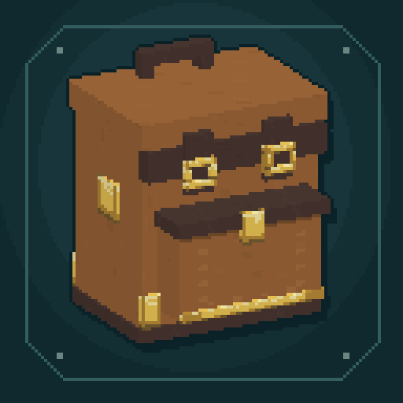

# Fabricated Backpacks

Modular backpacks for **Minecraft Java Edition 26.2 on Fabric**.

**0.5.0-alpha is a development build.** Back up worlds before testing it.
The feature list describes the current implementation, not a claim that every
interaction or multiplayer scenario has passed acceptance testing. Release
evidence belongs in [Verification](docs/VERIFICATION.md).

## What is included

- Six backpack tiers, from leather to netherite, with persistent contents,
  upgrades, remembered slots and settings.
- Original 3D leather models, separate body and trim colors, tier fittings,
  placed blocks, a worn model and a selected-item exterior display.
- A native backpack equipment slot that leaves the chest armor slot available.
- Modular collection, filtering, processing, transfer, resource, music,
  protection and mob-capture upgrades.
- An item and recipe browser with recipes, uses, search, bookmarks, history,
  ingredient displays and server-checked workstation transfer.
- Shift contents previews, per-backpack preferences and private settings
  templates that never copy physical inventory.

See [Features and current limits](docs/FEATURES.md) for the full catalog,
workstation behavior and remaining alpha work.

## Requirements

| Component | Target |
| --- | --- |
| Minecraft Java Edition | 26.2 |
| Java | 25 |
| Fabric Loader | 0.19.3 or newer |
| Fabric API | 0.158.0+26.2 or newer compatible 26.2 build |
| Team Reborn Energy API | 5.0.0, included in the built mod JAR |

Install the same mod build and compatible Fabric API on the client and server.
The native equipment slot and recipe browser do not require separate equipment
or recipe-viewer mods. Only the target listed above is supported by this build;
other Minecraft versions and loaders need separate ports.

When a verified release is available, place its main JAR in the instance's
`mods` directory. Do not install the sources JAR or the separate development
test mod. Build instructions are in [Building and testing](docs/BUILDING.md).

## First backpack

The leather backpack uses four leather, four string and a chest. The recipe
browser shows the arrangement and subsequent tier recipes. Tier upgrades retain
the source backpack's components rather than crafting an empty replacement.

Use a held backpack to open it. Sneak-use it on a block to place it, unless an
installed deposit/restock upgrade handles that container interaction. Use a
placed backpack to open it; sneak-use it with an empty main hand to pick it up
when nobody is viewing it.

Press **G** for the equipment panel and move a backpack into its dedicated slot.
Press **B** to open the equipped backpack. If none is equipped, B looks for one
in the player's inventory; if none exists, it opens the equipment panel.

Hover a backpack and hold **Shift** to preview its stored items. **Prefs** opens
settings, exterior-item controls and personal templates. Display slot numbers
start at 1; enter 0 to hide the exterior item.

## Controls

These defaults can be changed in Minecraft's Controls screen.

| Action | Default |
| --- | --- |
| Open backpack | B |
| Open equipment panel | G |
| Open recipe browser | O |
| Tool selection action | K |
| Use deposit / restock upgrade | C |
| Force deposit / force restock | Unbound |

Point at a container and press C to use the first enabled deposit/restock
upgrade on the first carried backpack. Equipment takes priority. The action
does not cascade through unrelated carried bags; separate optional bindings
can force a particular transfer direction.

The backpack's **Items** button opens the browser. Native workstation screens
also provide a **Recipe browser** button and accept its configured opening key
when a text field is not focused. Put down the cursor item before opening it.

Within the browser, click or R shows recipes; right click or U shows uses.
Shift-click, middle click or B toggles an item bookmark. Ctrl+F focuses search,
Alt+Left/Right navigates history, and Ctrl+wheel scrolls long ingredient lists.
These internal shortcuts are currently fixed. Search supports names,
`@namespace`, `#tooltip`, quoted phrases and `-exclusions`.

Recipe transfer moves one complete set, or the maximum complete sets up to 64,
into an **already open compatible workstation**. Crafting, stonecutting,
smithing and furnace-family recipes support transfer in portable and vanilla
workstations. Transfer does not craft the result, open a station automatically,
or grant missing ingredients. Other recipe categories remain viewable.

## Documentation

- [Features and current limits](docs/FEATURES.md)
- [Server configuration and data packs](docs/CONFIGURATION.md)
- [Building and testing](docs/BUILDING.md)
- [Verification](docs/VERIFICATION.md)
- [Changelog](CHANGELOG.md)
- [Original asset pipeline](tools/ASSET_PIPELINE.md)

## License

The project code and original project artwork are available under the
[MIT License](LICENSE). Minecraft and separately supplied dependencies retain
their own licenses.
