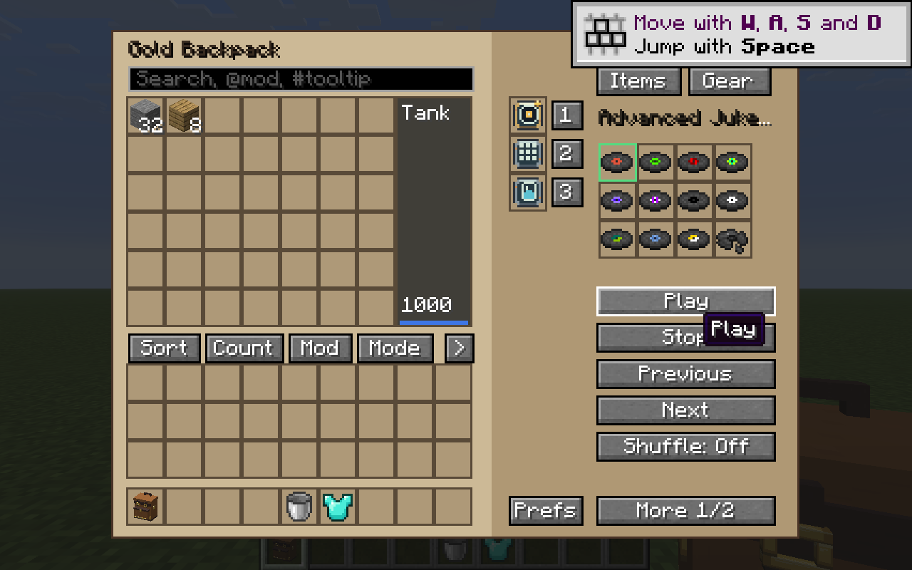
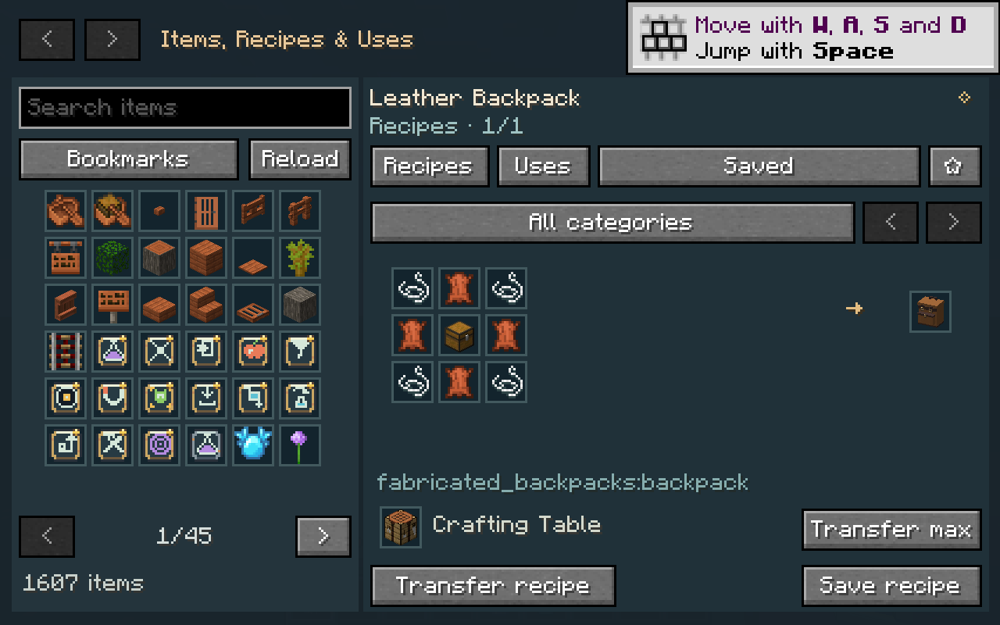
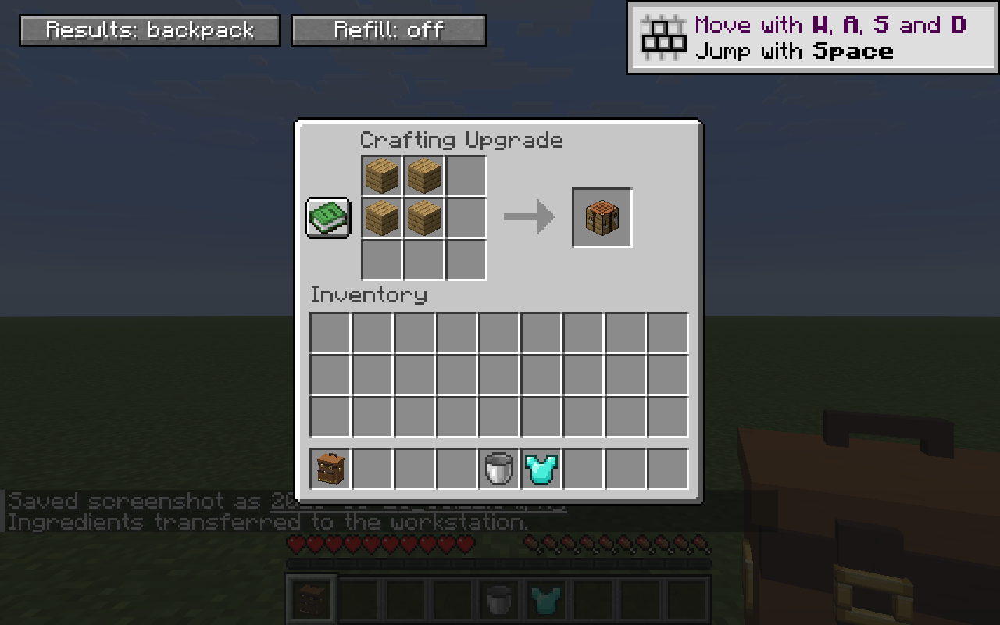
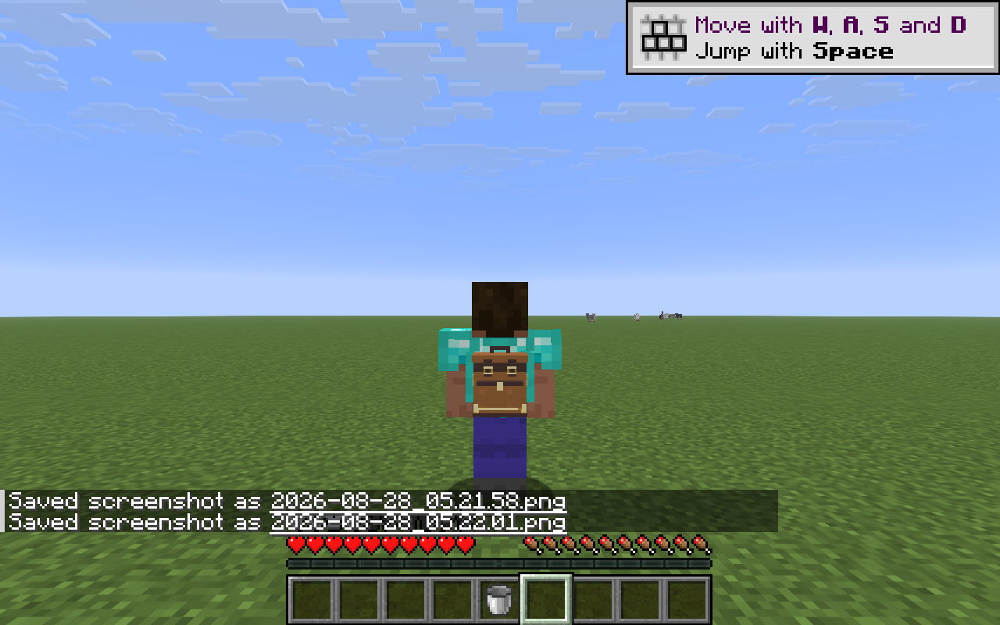
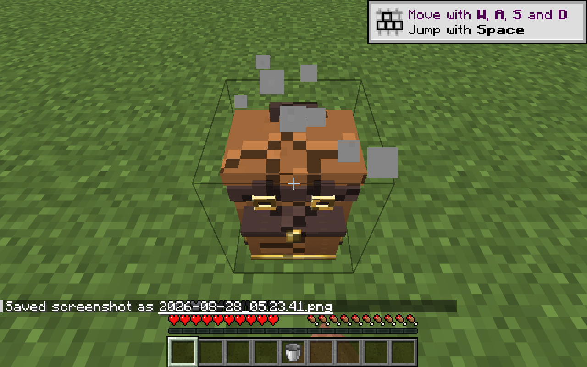
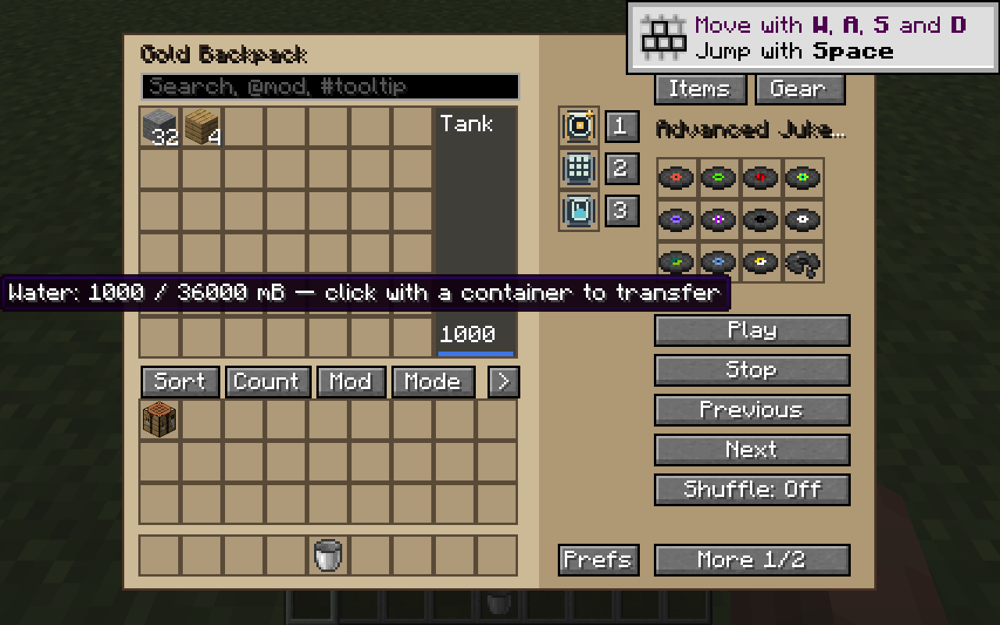

# Production gameplay gallery

Actual **Fabricated Backpacks 0.5.0-alpha** production captures on **Minecraft 26.2 / Fabric**, with **no project test mod loaded**. The recorded JAR has SHA-256:

`a91475783e00ac3a8596c27fec77fdbfe6145a47b3cd6b306c2764e7180c6c4d`

Supplies were prepared with vanilla commands; the recorded interactions used native game and mod controls. These are unaltered F2 PNGs and may show Minecraft's tutorial toast. They document selected observations, not every feature or audio playback.

See [Features](FEATURES.md) and the [Verification record](VERIFICATION.md) for scope and checks.

## Twelve music discs

The Advanced Jukebox Upgrade displays twelve discs and its playback controls. This still does not establish audible playback.

## Native recipe browser

At GUI scale 3, the empty search hint stays inside its input beside the recipe title.

## Portable crafting

Four oak planks occupy the crafting grid, with a crafting table shown in the result slot.

## Backpack with armor

A gold backpack and diamond chestplate are visible together in third person.

## Survival mining

A placed gold backpack during the recorded Survival mining interaction, with the native breaking overlay visible.

## Separate client restart

The backpack was reopened after a separate production client launch. This frame shows 32 stone, 4 oak planks, twelve discs, and a water tooltip reading 1000 / 36000 mB. The verification record describes the restart check.
