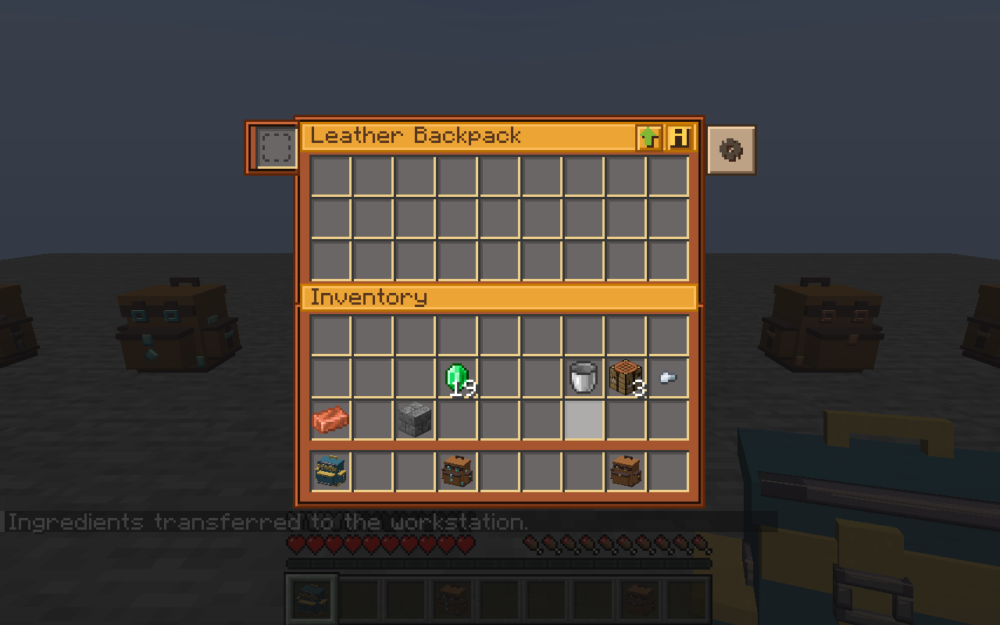
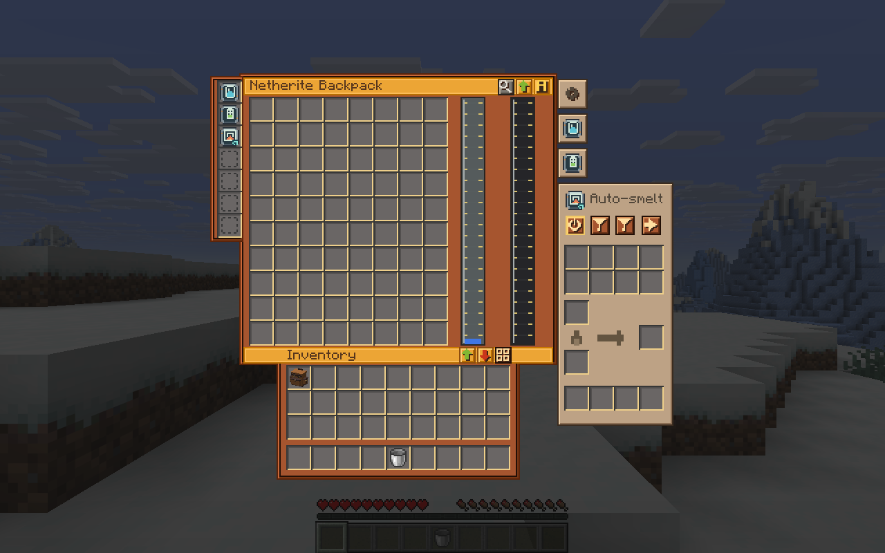
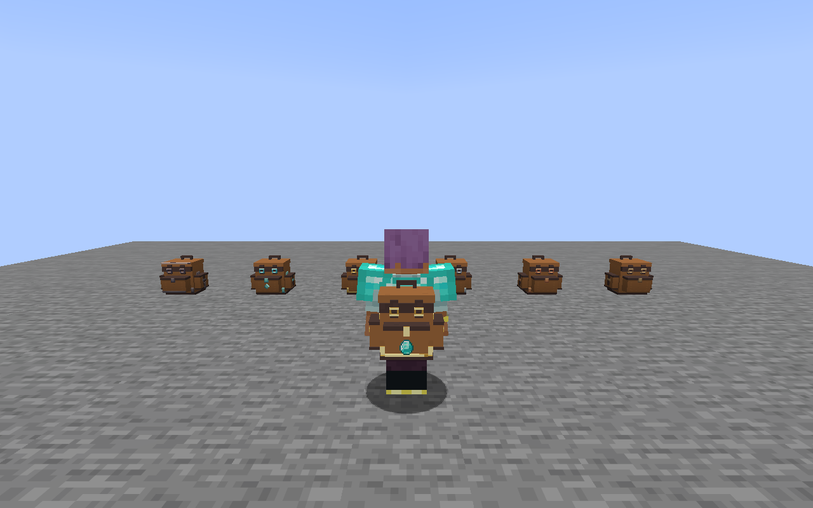
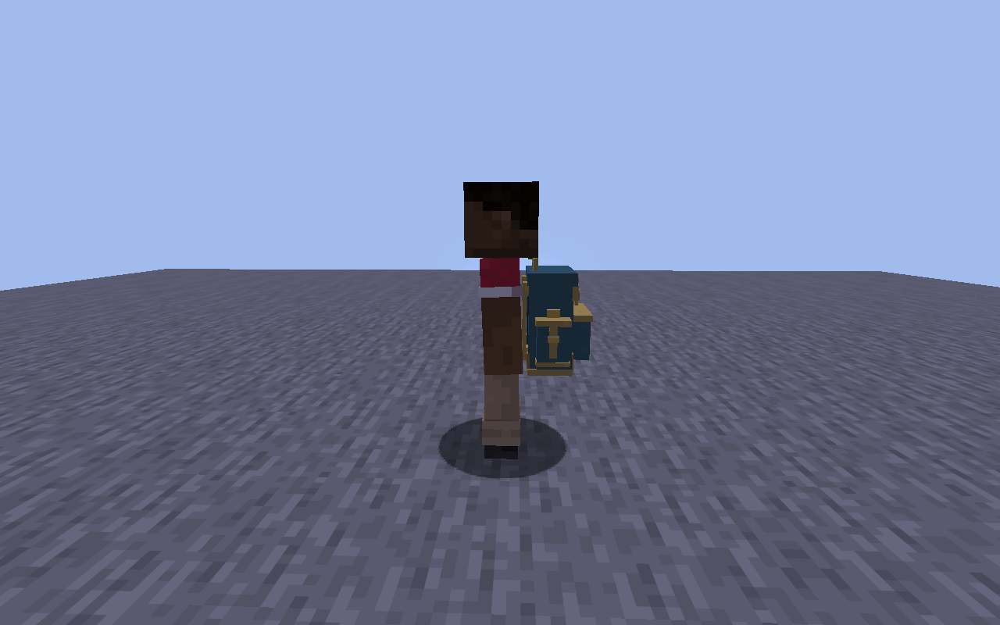

# Interface and worn-model revision

Status: **unreleased; local verification passed on 2026-08-28**. This revision
follows feedback on the published 0.5.0-alpha. Its code and new screenshots must
not be confused with that immutable release artifact.

## Interface

The backpack screen uses a brown leather frame, amber title strips, gray recessed
cells, physical upgrade slots at the left, and installed-upgrade item tabs at the
right. The normal persistent labels are the backpack title, Inventory, and the
selected upgrade's short name. Controls use original pixel icons; their full
names and current settings remain available through tooltips and narration.

Search is collapsed until requested with its icon or Ctrl+F. Storage expands to
show as many complete rows as fit. Smaller viewports use paging, and narrow
windows reduce panel columns without shrinking native item hit targets. Custom
upgrade names retain their full tooltip and use an ellipsis when necessary.

The reference layout uses a continuous 176-pixel body for nine columns and a
230-pixel body for twelve columns. The Inventory strip spans the storage width,
with the nine-column player inventory centered below. An expanded upgrade panel
occupies its tab's position; a separate compact rail is used when the full
accordion cannot fit. Resource gauges are 16 pixels wide, centered in their
existing reserved storage footprints. Dark headings explicitly disable the
native text shadow, including the ellipsis on a clipped name, to avoid a doubled
appearance. Cooking panels keep input filters above the furnace and fuel filters
below it, preserving their physical filter indices.

The header separates sorting from the sort-order selector. The settings tab
also provides equipment and memory/no-sort editing, keeping those labels off
the main screen. Basic backpacks show only the two sort controls in the header;
Ctrl+F and the recipe-browser key remain available.

**B** still opens the equipped backpack with empty hands. **G** opens the native
equipment slot. Both are ordinary rebindable Minecraft controls.

## Model

The original generated model now has two attached side pouches and a deeper
front pocket. The worn transform covers the torso to the upper hips, with a
measured 0.275 model-pixel gap at the back contact, both bare and with chest armor.
It continues to inherit the player's torso pose. Body and trim dye independently.
The exterior item display and placed interaction shapes follow the new geometry.

Actual Minecraft rear, side, armor, crouch, and placed captures were inspected
alongside the geometric checks. The two-client rear and side captures show a
real remote player standing without armor; those two stills do not establish
remote armor, swimming, or motion clearance.

## Verification

The complete matrix passed against verification run
`9281e41d-fc97-43f6-b7e5-ad85d5dd7cb3`, with 628 hashed source/build inputs.

| Check | Result |
| --- | --- |
| Deterministic assets | 358 generated files checked; 26 asset tests passed |
| Evidence checker | 37 tests passed |
| Fresh Java build | 408 unit invocations and 140 server GameTests passed; no build cache or reused task results |
| Full rendered client | Passed in JVM 32532; 67 unedited Minecraft screenshots retained |
| Separate client restart | Passed in JVM 19504, reading the world written by JVM 32532 |
| Two real multiplayer clients | Passed in host JVM 35856 and guest JVM 36660 |
| Production JAR, without the test mod | New-world desktop session passed in JVM 29196 |
| Complete evidence gate | `python tools/verify_evidence.py check --release` passed |

The tested production JAR SHA-256 is:

```text
56a7f13c7b0334cafc6c0f6967816f51fa57fc8c7ea8928fef3a1cc26ef9da1d
```

Client checks include reference geometry at GUI scales 2 and 3, narrow-window
fallbacks, native glyph shadows after clipping, native upgrade hit targets,
the eight-input/four-fuel cooking layout, retained upgrade inventories, item
and record transfers, resize/page changes during dragging, separate tank
selection, key mappings, real jukebox audio, and world persistence. The existing
browser, crafting, filtering, bulk-transfer, configuration, and placed-model
scenarios also passed. These are tested cases, not a claim that every mod
combination or gameplay interaction has been exercised.

For the desktop check, a new Survival world was created through Minecraft's
menus. Normal item commands supplied the fixtures; actual inventory clicks
equipped both backpack tiers and installed the tank, battery, and automatic
smelting upgrades. **B** opened the worn backpack with empty hands. Clicking the
slim tank with a water bucket stored 1,000 mB and returned an empty bucket. After
saving, returning to the title screen, and reopening the world, the equipment,
upgrades, selected panel, inventory items, and 1,000 mB remained present. The
worn model was also inspected with F5. The window stayed at 1280 by 800 pixels;
only Minecraft's GUI scale changed to show all ten Netherite rows.

Local diagnostics are retained in `build/ui-reference26-*.log`,
`build/client-evidence/reference26`, and `build/verification/release.json`.
The multiplayer run ID is `0d903129-b1a0-44a0-98ea-1861bfd22a9c`.
The five raw desktop captures are listed in `build/verification/manual.json`.
These generated local records are not committed or presented as an independent
audit of the observations.

## Unedited Minecraft captures

Basic backpack at GUI scale 3, from the full client test:



Production JAR at GUI scale 2, after saving and reopening the new world:



Actual local player wearing chest armor, from the full client test:



Actual remote player viewed by the second multiplayer client:



## Publication

The existing GitHub 0.5.0-alpha release is unchanged. This revision has not been
uploaded as a replacement artifact. CurseForge and Modrinth project submissions
remain pending confirmation of the prepared public forms.

The source revision is maintained separately on
`codex/backpack-ui-and-worn-model`. A future downloadable release must use a
distinct version and retain its own verification record; the existing alpha
tag and its published files must not be overwritten.
